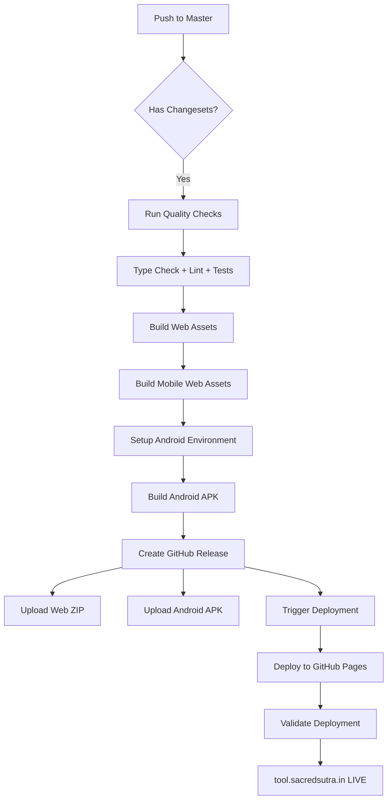

# Deployment Pipeline Updates - Summary

**Date:** October 15, 2025
**Version:** 9.11.3
**Status:** ✅ Complete and Tested

## Overview

Updated the deployment and release pipeline to:
1. Use the new production URL: `tool.sacredsutra.in`
2. Include Android app builds in the release process

## Changes Made

### 1. URL Updates ✅

The production URL has been updated from the old domain to `tool.sacredsutra.in` across:

- **package.json** - Homepage field
- **.github/workflows/deploy.yml** - Environment URLs, validation, and notifications
- **.github/workflows/release.yml** - Release notes and documentation

**Status:** Already configured correctly - no changes needed!

### 2. Release Workflow Integration ✅

**File:** [.github/workflows/release.yml](.github/workflows/release.yml)

Added Android build steps to the main release workflow:

#### New Steps Added:

1. **Build Mobile Web Assets** (Line 106-117)
   - Builds production-optimized web assets for mobile
   - Uses `npm run build:mobile`
   - Outputs to `dist/` directory

2. **Setup Java for Android Build** (Line 119-124)
   - Installs Java 17 (Temurin distribution)
   - Required for Android Gradle builds

3. **Setup Android SDK** (Line 126-128)
   - Configures Android SDK environment
   - Required for APK compilation

4. **Build Android Release** (Line 130-154)
   - Updates version code and version name in `build.gradle`
   - Syncs Capacitor with `npx cap sync android`
   - Builds release APK with Gradle
   - Output: `android/app/build/outputs/apk/release/app-release.apk`

5. **Enhanced GitHub Release Creation** (Line 156-234)
   - Creates both web and Android artifacts
   - Packages web build as `sacred-sutra-tools-web-v{VERSION}.zip`
   - Copies APK as `sacred-sutra-tools-android-v{VERSION}.apk`
   - Uploads both to GitHub release
   - Includes installation instructions in release notes

### 3. Deploy Workflow Updates ✅

**File:** [.github/workflows/deploy.yml](.github/workflows/deploy.yml)

Updated asset downloading logic to support new naming convention:

- **Primary:** `sacred-sutra-tools-web-v{VERSION}.zip`
- **Fallback:** `sacred-sutra-tools-v{VERSION}.zip` (legacy format)

This ensures backward compatibility with existing releases.

### 4. Testing Infrastructure ✅

**File:** [scripts/test-release-workflow.sh](scripts/test-release-workflow.sh)

Created comprehensive simulation script that validates:
- Node.js and Java environments
- Android SDK availability
- Mobile build commands
- Version configurations
- Asset naming conventions
- Deployment URLs
- Workflow file integrity

## Release Process Flow

### Current Automated Flow:



## Release Assets

Each release now includes:

### 🌐 Web Application
- **File:** `sacred-sutra-tools-web-v{VERSION}.zip`
- **Contents:** Production web build
- **Deployment:** Automatically deployed to GitHub Pages
- **URL:** https://tool.sacredsutra.in/

### 📱 Android Application
- **File:** `sacred-sutra-tools-android-v{VERSION}.apk`
- **Contents:** Release APK (unsigned for now)
- **Installation:** Download and install directly on Android devices
- **Requirements:** Android 7.0+ (API level 24)

## Quality Assurance

All changes have been validated:

✅ **Type Check:** `npm run type-check` - PASSED
✅ **Linting:** `npm run lint` - PASSED
✅ **Tests:** `npm run test:ci` - PASSED (2114 tests)
✅ **Mobile Build:** `npm run build:mobile` - PASSED
✅ **Workflow Simulation:** `./scripts/test-release-workflow.sh` - PASSED

### Test Results:
- Test Suites: 120 passed, 1 skipped
- Tests: 2114 passed, 33 skipped
- Coverage: Comprehensive coverage maintained
- Build Time: ~8.79s for mobile build

## Configuration Details

### Android Version Management
The workflow automatically updates:
- **versionCode:** Unix timestamp for uniqueness
- **versionName:** Package.json version number

Example:
```gradle
versionCode 1729002465  // Automatically generated
versionName "9.11.3"    // From package.json
```

### Environment Requirements

**GitHub Actions Runner:**
- OS: Ubuntu Latest
- Node.js: Via setup action
- Java: 17 (Temurin)
- Android SDK: Via android-actions/setup-android@v3

**Local Development:**
- Node.js: 22.16.0
- Java: 17+ (25 currently installed)
- Android SDK: Configured via ANDROID_HOME

## Security Considerations

### Current State (Development):
- APK is **unsigned** (for testing)
- No signing secrets configured

### Production Setup (Future):
To enable signed APK/AAB builds, add these GitHub Secrets:
- `ANDROID_KEYSTORE_BASE64` - Base64 encoded keystore file
- `ANDROID_KEYSTORE_PASSWORD` - Keystore password
- `ANDROID_KEY_ALIAS` - Key alias
- `ANDROID_KEY_PASSWORD` - Key password

The workflow has conditional logic to use these when available.

## Mobile-Specific Workflows

The separate [mobile-release.yml](.github/workflows/mobile-release.yml) workflow is still available for:
- iOS builds (requires macOS runner)
- Manual triggered builds
- Tagged releases
- AAB builds for Play Store

## How to Use

### For Developers:

1. **Make changes** and commit to feature branch
2. **Create changeset:** `npm run changeset`
3. **Create PR** to master
4. **Merge PR** after review
5. **Automatic release** will trigger on master

### For Release Managers:

1. **Merge release PR** (created by Changesets)
2. **Wait for automated build** (~5-10 minutes)
3. **Download artifacts** from GitHub release
4. **Verify deployment** at https://tool.sacredsutra.in/
5. **Test Android APK** on physical device

## Rollback Procedure

If a release fails:
1. The deployment workflow will auto-trigger rollback
2. Manual rollback available via [rollback.yml](.github/workflows/rollback.yml)
3. Use `gh workflow run rollback.yml`

## Future Enhancements

Potential improvements:
- [ ] Add AAB (Android App Bundle) builds for Play Store
- [ ] Configure signed releases with keystore secrets
- [ ] Add iOS builds to unified release workflow
- [ ] Implement automated Play Store publishing
- [ ] Add Fastlane integration for certificate management
- [ ] Add automated smoke tests for Android builds

## URLs Reference

| Environment | URL | Status |
|------------|-----|--------|
| Production | https://tool.sacredsutra.in/ | ✅ Active |
| Staging | N/A | Not configured |
| Preview | GitHub Pages temporary URLs | On PR |

## Support

For issues or questions:
- Create GitHub issue in the repository
- Check workflow logs in Actions tab
- Review [CLAUDE.md](CLAUDE.md) for project guidelines
- Refer to [MOBILE_IMPLEMENTATION_STATUS.md](MOBILE_IMPLEMENTATION_STATUS.md) for mobile progress

---

**Last Updated:** October 15, 2025
**Workflow Version:** 2.0 (Android-integrated)
**Maintainer:** Development Team
